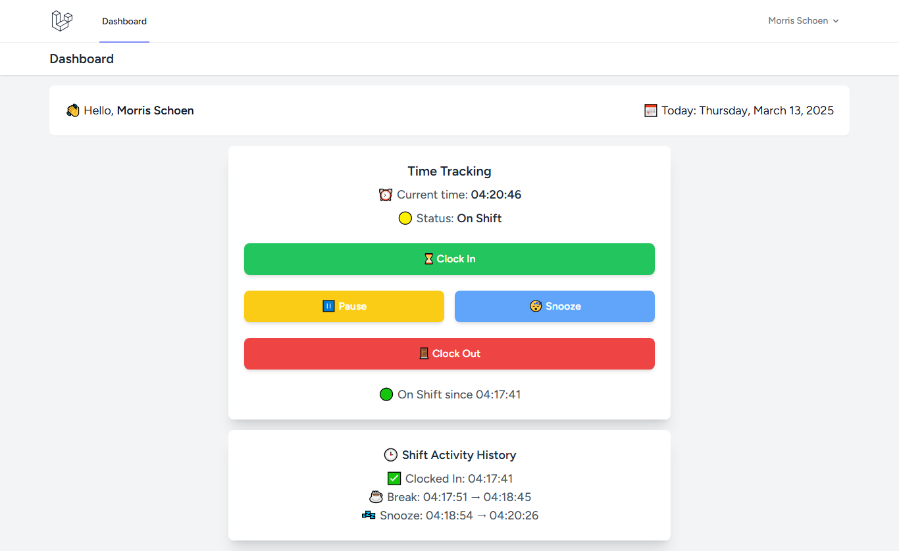
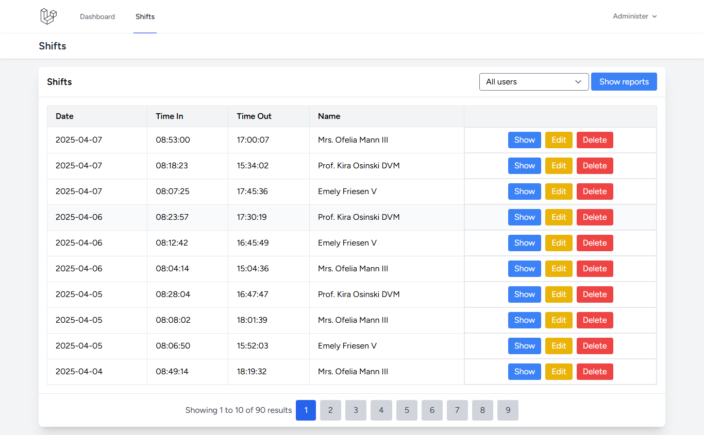
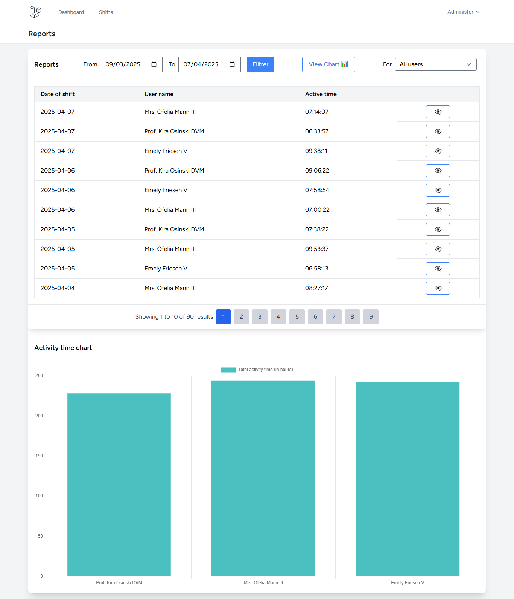

# timetrackerapp
A Laravel's application to track the working activity time

<p><a href="https://laravel.com" target="_blank"></a></p>


## How to use

### Requirements

- **PHP 8.0+**
- **Laravel 10+**
- **Composer**
- **Node** and **npm**
- **MySQL** or **SQLite**
- **PHPUnit** or **PestPHP** for testing

### Installation

1. Get the project from this [GitHub repository](https://github.com/JuniorTak/timetrackerapp)
2. Open your terminal at the root of the project directory 
3. Install the project's dependencies: run ```composer install```, then ```npm install```
4. Generate the app key, run ```php artisan key:generate```
5. Set up your environements by adding and configuring the *.env* file (Ensure to configure the database)
6. Run the database migration: ```php artisan migrate```
5. To execute the app, start the developement server for assets building: ```npm run dev```
6. In another terminal, navigate to the root of the project directory and run ```php artisan serve```
7. Open your browser at http://127.0.0.1:8000 and enjoy!!!

### Dummy data

1. To add dummy data for testing run the database seeder: ```php artisan db:seed```
2. This will create an admin user with the following email **admin@example.com** and three random non-admin users with shifts and related data. Passwords for all dummy users: **password**

### Screensshots

- Tracking activity time of a user



- Admin dashboard showing all shifts



- Admin dashboard showing reports of all users with a chart



## Author

- [Hyppolite T.](https://tinyurl.com/htfmystrikingly)

## License

Licensed under the [MIT license](https://opensource.org/licenses/MIT).
